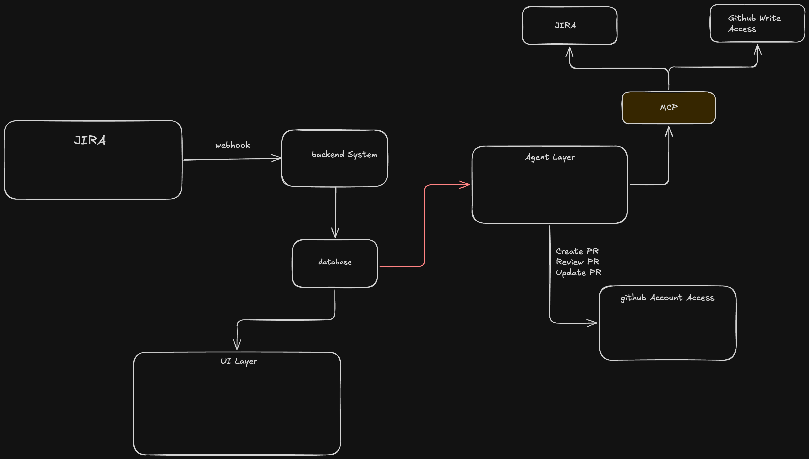

Backend (Expose API) -> Jira register Weebhook -> Jira POST to Webhook -> logging it now.

As the Backend is not deployed yet, hence using ngrok to expose the local server to the internet.

registering the same ngrok url in the Jira Webhook.

Jira Register Webhook: https://officialpradeepsahu.atlassian.net/plugins/servlet/webhooks

Jira Page Link : https://officialpradeepsahu.atlassian.net/jira/software/projects/STONE/boards/2

To create the tunnel through ngrok, run the following command in the terminal:

```
ngrok http 3000
```

### Initial Design of the System:


